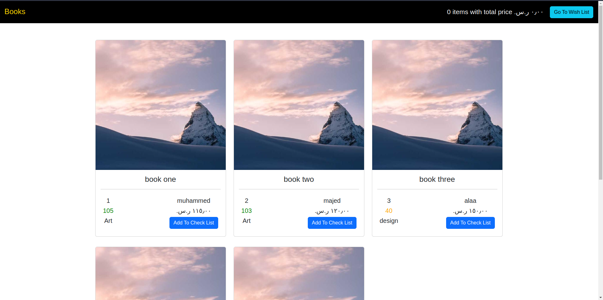
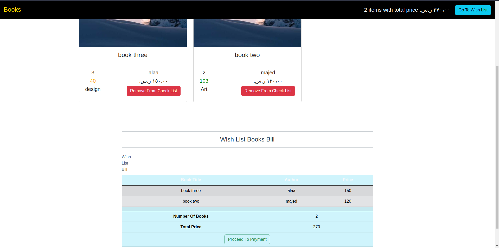

# First VueJs Component App
Actually this project is so simple, i have made simple WISH LIST for books 📖.
in the main page u can:
1. see all books
2. add any book to ur wish list
3. go to wishlist then see ur wish list books
4. u can remove any book from ur wish list
5. finally u can see ur bill and total price 

## Project setup
```
npm install
```

### Compiles and hot-reloads for development
```
npm run serve
```

### Compiles and minifies for production
```
npm run build
```

### Customize configuration
See [Configuration Reference](https://cli.vuejs.org/config/).

### Here are some images
| Image 1      | Image 2      |
| ----------- | ----------- |
|   |   |


